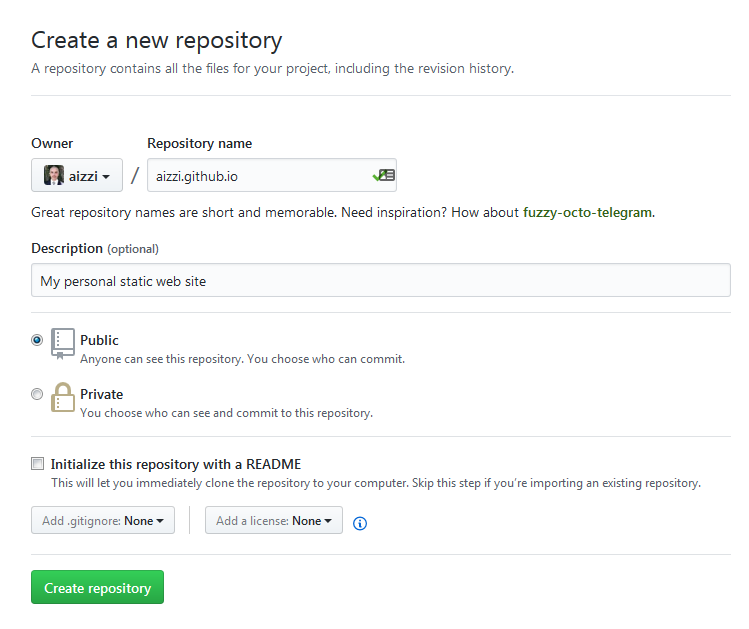

# Setup a static web server

If you want to build a website, sooner or later you need a way to test it and verify that users will be presented with what you intended to. In order to do so, you need a webserver.

*Apache*, *NGINX*, *Node.js*, *Tomcat* are some examples of web servers you can choose from. These programs are powerful and complex to setup. Use one of them could be a choice if you want to build and control your own environment, but this add an extra layer of unneeded complexity if what you want is just to start learning some plain HTML.

Nowadays there are other choices other than set up your own development environment. For example, you can use resources on Cloud. *Amazon AWS*, *IBM Softlayer*, *Microsoft Azure* are all possible choices. However, they replace one complexity layer with another one: you need to understand how they work and setup the environment (aside of providing your credit card number).

Luckily, there is a choice we can leverage to get quickly up and running with a basic static webserver: [GitHub Pages](https://pages.github.com/). GitHub Pages (GHP) is a static webserver based on [Jekyll](https://jekyllrb.com/) engine, integrated with GitHub repositories. It is able to serve static HTML pages as well as transform Markdown documents into HTML pages. It can works as a blogging platform and is integrated with your GitHub repositories to provide online documentation about your project.

Overall, it is an easy and inexpensive way to start your journey into web programming. Let's see how we can set it up.

GitHub Pages can serve two types of sites: *User or organization site* or *Project site*. At this stage, you can think of a *User or organization site* as a main container for all your *Project site*: all your *Project sites* will be served as children of your *User site*.

We are not interested now in digging into the working details of GitHub Pages, so we will start with focusing on creating your *User site* in order to use it to serve static web pages.

By now you should have created your GitHub profile. For example, my public profile is available at https://github.com/aizzi.

In order to create your GitHub Pages user site, you must create a new repository called `<username>.github.com`. Pay attention, that it must exactly match your username. If you are in doubt, you can find your username on the top-left side of your profile page, under your picture.


So, go on and create it.



Once it is created, create the index page of your site `index.html` and copy the following text in it (changing my name with your one):

```HTML
<!DOCTYPE html>
<html>

  <head>
    <title>Antonello Izzi's Web Site</title>
  </head>

  <body>
    <h1>Antonello Izzi's Web Site</h1>
    <p>My personal static web site</p>
  </body>

</html>
```

That's it: your personal website is ready for your at the address `https://<username>.github.io`. Go on and check it!

Now, clone the repository on your computer and you are ready to go.

The nice part of this setup is that publishing your site is as easy as pushing your commits to the master branch of `<username>.github.io` repository. The GitHub Jekyll backend will do the rest, processing your site and publishing it.

> Note: since your commit has to be processed by the Jekyll engine, it could take a while before you see your changes published. Be patient and allow for it to work. Later on in this course we will setup a local Jekyll environment to test your changes before to push them, but for now what we have is more than enough.
